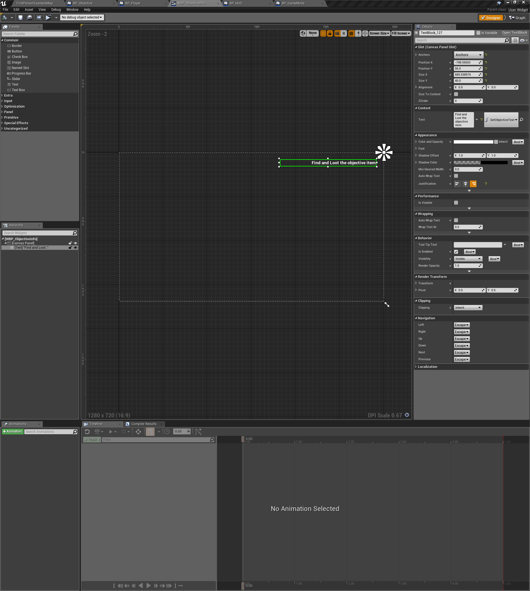
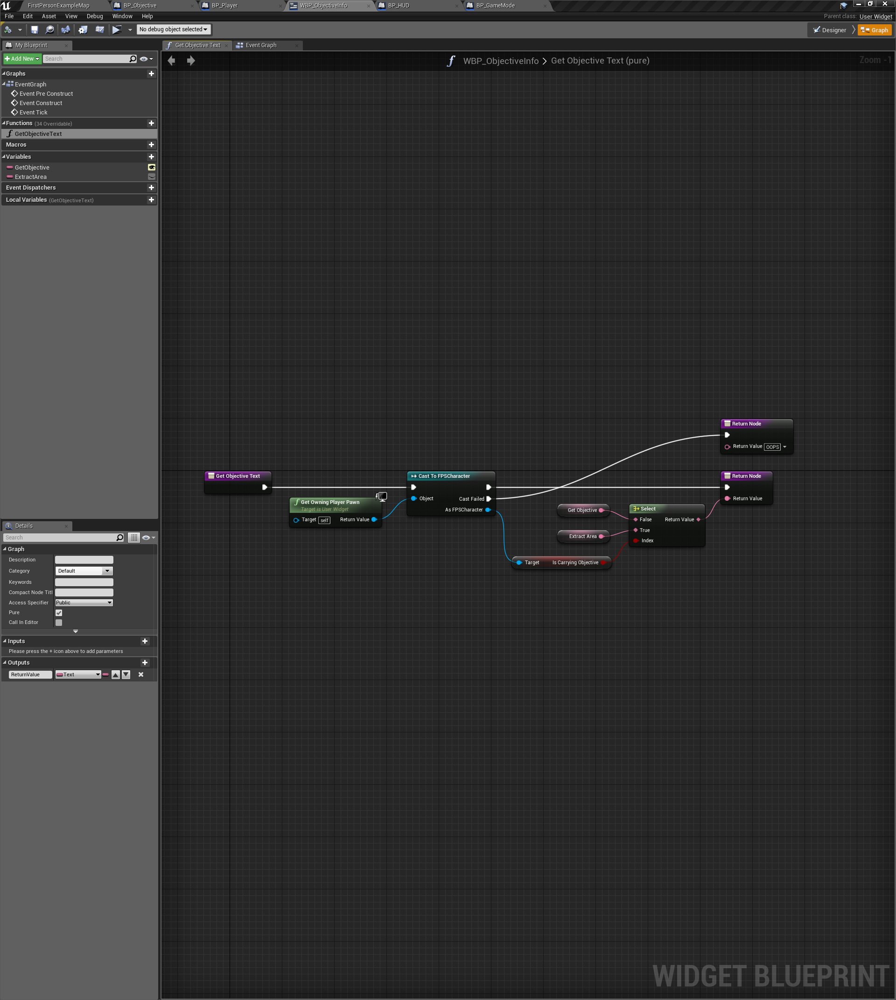
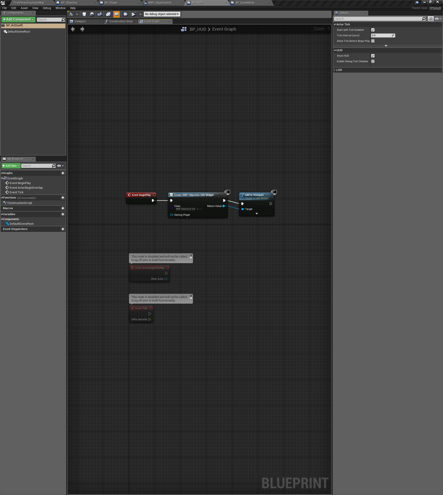

# Notes

## Setup Objective UI with UMG, Section 2, Lecture 14

- HUD for FPSCharacter
  - Create new "Widget Blueprint" (WBP_ObjectiveInfo) to display FPSCharacter bIsCarryingObjective
    - In Widget Blueprint "designer" add "Text"
    - With "Text" selected select Content > Text > "Create Binding" and name it "GetObjectiveText".  
    - In "Graph" edit "GetObjectiveText" 
  - Create new Blueprint class, "BP_HUD", from "FPSHUD"
    - On "Event BeginPlay" add WBP_ObjectiveInfo" to the viewport 

